 # Báo Cáo Bài Tập Thực Hành MCLab01

## 1. Thông tin sinh viên
* **MSSV:** 23110156
* **Họ tên:** Nguyễn Minh Hoàng
* **Lựa chọn bài toán:** A - Task Pocket - Quản lý công việc cá nhân

## 2. Problem & Requirements
* **Mô tả ngắn bài toán:**
Xây dựng phần logic cho một ứng dụng điện thoại quản lý công việc cá nhân. Chưa có giao diện; người dùng được mô phỏng bằng các thao tác gọi hàm trong index.ts và xem kết quả trên Terminal. Với ứng dụng, người dùng có thể quản lý danh sách các công việc cá nhân. Mỗi công việc sẽ có mã số, tên, số giờ dự kiến sẽ làm công việc đó, trạng thái, mức độ ưu tiên, và có thể có người phụ trách. Chương trình sẽ hiển thị dữ liệu output qua console, lọc theo trạng thái, tính tổng số giờ dự kiến, tìm công việc theo ID và xử lý các tình huống dữ liệu không đầy đủ.

* **Các chức năng đã làm:**
    * **Các chức năng bắt buộc:**

    | Chức năng logic | Output quan sát trong Terminal | Khái niệm TypeScript |
    |-----------------|--------------------------------|----------------------|
    | Danh sách Task | In từng công việc | Array of objects + type alias |
    | Task status | todo/doing/done | Literal union |
    | Assignee có thể thiếu | "Chưa phân công" khi chưa có | Optional/Nullable + ?? |
    | FilterByStatus | Danh sách theo trạng thái công việc | Typed function |
    | Tổng số giờ dự kiến | Tổng số giờ theo filter | number return type |
    | Tìm task theo ID | Task hoặc null | Union + narrowing |
    | Action/callback | Mô phỏng mở Task | Function type |
    | Raw data validation | Reject dữ liệu sai | unknown + type guard |

    * **Các chức năng mở rộng thêm:**

    | Chức năng logic | Output quan sát trong Terminal | Khái niệm TypeScript |
    |-----------------|--------------------------------|----------------------|
    | FilterByPriority | Danh sách theo độ ưu tiên công việc | Typed function |
    | SortTasks | Sắp xếp danh sách công việc theo thời gian dự kiến hoặc độ ưu tiên (giảm dần hoặc tăng dần) | Typed function |
## 3. Type Model

Toàn bộ kiểu dữ liệu được định nghĩa trong `task.types.ts`:

```typescript
export type TaskStatus = "todo" | "doing" | "done";
export type TaskPriority = "low" | "medium" | "high";
export type StatusFilter = "all" | TaskStatus;
export type PriorityFilter = "all" | TaskPriority;
export type SortBy = "estimatedHours" | "priority";
export type SortOrder = "asc" | "desc";


export type Task = {
    id: string;
    title: string;
    estimatedHours: number;
    status: TaskStatus;
    priority: TaskPriority;
    assignee: string | null; //nullable property
    note?: string;//optional property
};
```

**Giải thích các khái niệm TypeScript sử dụng:**

| Type Alias | `type Task = { ... }` | Đặt tên cho blueprint của đối tượng |
| Literal Union | `"todo" \| "doing" \| "done"` | Giới hạn giá trị chỉ trong tập hợp cố định |
| Nullable | `string \| null` | Trường bắt buộc tồn tại nhưng có thể rỗng |
| Optional (`?:`) | `note?: string` | Trường có thể không tồn tại trong object |


## 4. Logic chính

Toàn bộ logic nghiệp vụ nằm trong `task.service.ts` và `task.callback.ts`:

### `getTasks(tasksList)` — Lấy và hiển thị danh sách Task
Duyệt từng task và copy ra một bản copy của task list chứ không dùng bản task gốc tránh để tránh ảnh hưởng đến việc filter hay sort sau này, áp dụng **Nullish Coalescing (`??`)** để fallback assignee về `"Unassigned"` khi giá trị là `null`.
```typescript
export function getTasks(tasksList: Task[]): Task[]{
    return tasksList.map((task) => ({...task,
        assignee: task.assignee ?? "Unassigned" 
    })); //return a copy of the tasks
};
//print all tasks at index.ts
const allTasks = getTasks(tasks);
console.log("\nAll tasks: ");
allTasks.forEach((task) => console.log(formatTaskOutput(task)));
```
* **Output:**
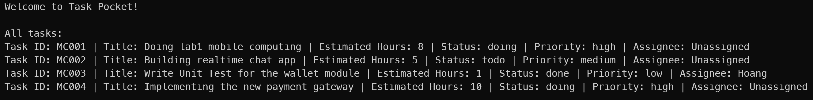

### `filterTasksByStatus(tasksList, filter)` — Lọc theo trạng thái
Nhận tham số kiểu `StatusFilter = "all" | TaskStatus`, trả về `Task[]`. Nếu filter là `"all"` thì trả về toàn bộ danh sách.

```typescript
export function filterTasksByStatus(tasksList: Task[], taskFilter: StatusFilter): Task[] {
    if(taskFilter === "all") return tasksList;
    return tasksList.filter((task) => task.status === taskFilter);
}
```

* **Output (`filterTasksByStatus(tasks, "doing")`):**
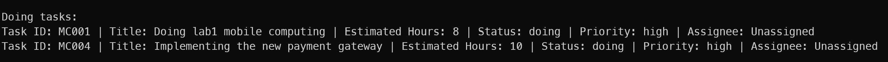

### `filterTasksByPriority(tasksList, filter)` — Lọc theo mức ưu tiên công việc
Nhận `PriorityFilter = "all" | TaskPriority` — tách kiểu riêng để TypeScript không cho phép truyền nhầm `statusFilter` vào filter priority.

```typescript
export function filterTasksByPriority(tasksList: Task[], taskFilter: PriorityFilter): Task[] {
    if(taskFilter === "all") return tasksList;
    return tasksList.filter((task) => task.priority === taskFilter);
}
```

* **Output (`filterTasksByPriority(tasks, "high")`):**
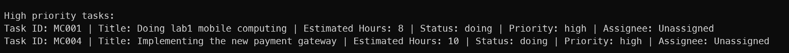

### `calculateTotalEstimatedHours(tasksList)` — Tính tổng số giờ
Dùng `Array.reduce()` để cộng dồn `estimatedHours`, return type tường minh là `number`.

```typescript
export function calculateTotalEstimatedHours(tasksList: Task[]): number {
    return tasksList.reduce((total, task) => total + task.estimatedHours, 0);
}
```

* **Output:**
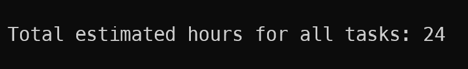

### `findTaskById(tasksList, taskId)` — Tìm task theo ID (Safety pattern)
Return type là `Task | null`. Caller **bắt buộc phải narrowing** trước khi sử dụng kết quả:

```typescript
export function findTaskById(tasksList: Task[], taskId: string): Task | null {
    return tasksList.find((task) => task.id === taskId) ?? null;
}
// index.ts
const selectedTask = findTaskById(tasks, "MC002");
if(selectedTask) {
    console.log(formatTaskOutput(selectedTask)); 
} else {
    console.log(`Task not found.`);
}
```

* **Output (tìm thấy — ID "MC002"):**
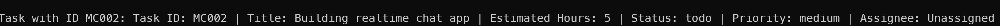
* **Output (không tìm thấy — ID "MC999"):**


### `isTask(value)` — Custom Type Guard 
Nhận `value: unknown` (dữ liệu bên ngoài chưa tin cậy), kiểm tra từng trường, return `value is Task`. Sau khi guard trả về `true`, TypeScript tự động narrow kiểu:

```typescript
export function isTask(value: unknown): value is Task {
    if(typeof value !== "object" || value === null) return false;
    const task = value as Record<string, unknown>;
    const validStatus = task.status === "todo" || task.status === "doing" || task.status === "done";
    const validPriority = task.priority === "low" || task.priority === "medium" || task.priority === "high";
    return (typeof task.id === "string" && typeof task.title === "string" &&
            typeof task.estimatedHours === "number" && validStatus && validPriority);
}
// index.ts
const unknownValue: unknown = { id: "AI001", title: "Integrate AI features",
    estimatedHours: 10, status: "todo", priority: "high", assignee: "Khoi" };
if(isTask(unknownValue)) console.log("Valid task:", unknownValue.title);
else console.log("Invalid task data");
```

* **Output (dữ liệu hợp lệ):**


* **Output (dữ liệu không hợp lệ — thử `status: "finished"`):**
```
Invalid task data
```

### `sortTasks(tasksList, sortBy, sortOrder)` — Sắp xếp
- **Không mutate** mảng gốc: dùng `[...tasksList]` để copy trước khi sort.
- Sort `estimatedHours`.
- Sort `priority`: dùng `indexOf()` để map chuỗi sang số thứ tự (`low=0, medium=1, high=2`).
- Dùng `direction = sortOrder === "asc" ? 1 : -1` để tránh duplicate logic.

```typescript
export function sortTasks(tasksList: Task[], sortBy: SortBy, sortOrder: SortOrder): Task[] {
    const sortedTasks = [...tasksList];
    const direction = sortOrder === "asc" ? 1 : -1;
    if(sortBy === "estimatedHours")
        return sortedTasks.sort((a, b) => (a.estimatedHours - b.estimatedHours) * direction);
    if(sortBy === "priority") {
        const priorityOrder: TaskPriority[] = ["low", "medium", "high"];
        return sortedTasks.sort((a, b) =>
            (priorityOrder.indexOf(a.priority) - priorityOrder.indexOf(b.priority)) * direction);
    }
    return sortedTasks;
}
```

* **Output (sort by estimatedHours asc):**

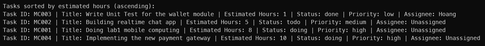

* **Output (sort by priority desc):**

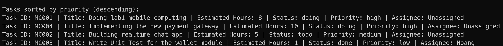

### `openTask(taskId)` — Callback pattern (`task.callback.ts`)
Định nghĩa `type OnOpenTask = (taskId: string) => void` làm blueprint, sau đó implement bằng `export const openTask: OnOpenTask = ...`. Dùng `findTaskById` kết hợp narrowing để xử lý an toàn.

```typescript
type OnOpenTask = (taskId: string) => void;

export const openTask: OnOpenTask = (taskId: string) => {
    const task = findTaskById(tasks, taskId);
    if(!task) { console.error(`Task with ID ${taskId} not found.`); return; }
    console.log(`Task with ID ${taskId} and title "${task.title}" has been opened.`);
};
```

* **Output (tìm thấy — `openTask("MC003")`):**


* **Output (không tìm thấy — `openTask("MC005")`):**


## 5. Kết quả chạy

### TypeScript type check (tsc --noEmit)

Kiểm tra toàn bộ source:

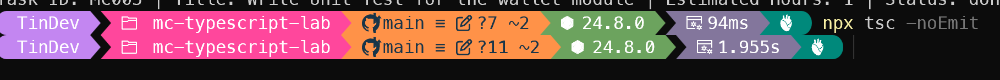
```bash
$ npx tsc --noEmit
# (no output) — exit code 0 
```

> Không có lỗi nào được báo cáo. Toàn bộ 5 file `.ts` đều pass type check.

### Biên dịch và chạy chương trình

```bash
npx tsc
node dist/index.js
```

**Output:**
```
Welcome to Task Pocket!

All tasks:
Task ID: MC001 | Title: Doing lab1 mobile computing | Estimated Hours: 8 | Status: doing | Priority: high | Assignee: Unassigned
Task ID: MC002 | Title: Building realtime chat app | Estimated Hours: 5 | Status: todo | Priority: medium | Assignee: Unassigned
Task ID: MC003 | Title: Write Unit Test for the wallet module | Estimated Hours: 1 | Status: done | Priority: low | Assignee: Hoang
Task ID: MC004 | Title: Implementing the new payment gateway | Estimated Hours: 10 | Status: doing | Priority: high | Assignee: Unassigned

Doing tasks:
Task ID: MC001 | Title: Doing lab1 mobile computing | Estimated Hours: 8 | Status: doing | Priority: high | Assignee: Unassigned
Task ID: MC004 | Title: Implementing the new payment gateway | Estimated Hours: 10 | Status: doing | Priority: high | Assignee: Unassigned

Total estimated hours for all tasks: 24

Task with ID MC002: Task ID: MC002 | Title: Building realtime chat app | Estimated Hours: 5 | Status: todo | Priority: medium | Assignee: Unassigned
Task with ID MC003 and title "Write Unit Test for the wallet module" has been opened.
Valid task:  Integrate AI features

High priority tasks:
Task ID: MC001 | Title: Doing lab1 mobile computing | Estimated Hours: 8 | Status: doing | Priority: high | Assignee: Unassigned
Task ID: MC004 | Title: Implementing the new payment gateway | Estimated Hours: 10 | Status: doing | Priority: high | Assignee: Unassigned

Tasks sorted by estimated hours (ascending):
Task ID: MC003 | Title: Write Unit Test for the wallet module | Estimated Hours: 1 | Status: done | Priority: low | Assignee: Hoang
Task ID: MC002 | Title: Building realtime chat app | Estimated Hours: 5 | Status: todo | Priority: medium | Assignee: Unassigned
Task ID: MC001 | Title: Doing lab1 mobile computing | Estimated Hours: 8 | Status: doing | Priority: high | Assignee: Unassigned
Task ID: MC004 | Title: Implementing the new payment gateway | Estimated Hours: 10 | Status: doing | Priority: high | Assignee: Unassigned

Tasks sorted by priority (descending):
Task ID: MC001 | Title: Doing lab1 mobile computing | Estimated Hours: 8 | Status: doing | Priority: high | Assignee: Unassigned
Task ID: MC004 | Title: Implementing the new payment gateway | Estimated Hours: 10 | Status: doing | Priority: high | Assignee: Unassigned
Task ID: MC002 | Title: Building realtime chat app | Estimated Hours: 5 | Status: todo | Priority: medium | Assignee: Unassigned
Task ID: MC003 | Title: Write Unit Test for the wallet module | Estimated Hours: 1 | Status: done | Priority: low | Assignee: Hoang
```

### Compiler bắt lỗi type 

Một trong những lợi ích cốt lõi của TypeScript là phát hiện lỗi **tại thời điểm biên dịch**, trước khi chương trình chạy.

**Bước 1 — Cố tình tạo lỗi kiểu:**

Gán giá trị sai cho status
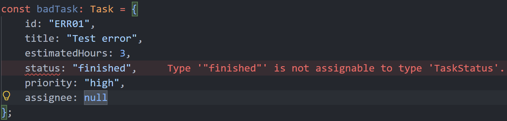

**Bước 2 — Compiler báo lỗi ngay:**
```
error: Type '"finished"' is not assignable to type 'TaskStatus'.
```

**Bước 3 — Sửa lại đúng, compiler pass:**
```typescript
status: "todo",  
```
```bash
$ npx tsc --noEmit
# (no output) — exit code 0 
```

> **Nhận xét:** Nếu dùng JavaScript thuần, lỗi `status: "finished"` sẽ âm thầm tồn tại trong production. Trong khi đó, TypeScript phát hiện và báo lỗi ngay khi lập trình viên gõ sai.


## 6. Code Organization

### Cấu trúc source trong VS Code

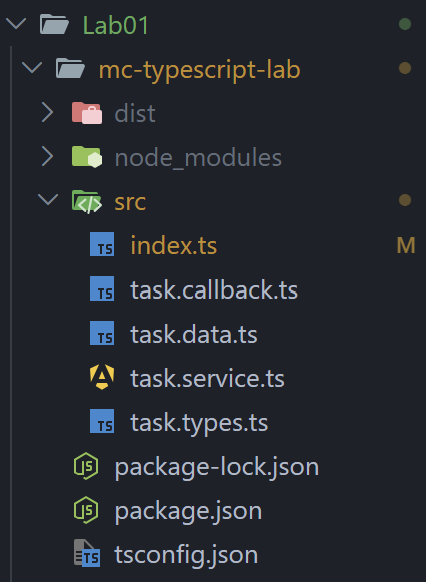

Dự án được tổ chức theo nguyên tắc **Separation of Concerns** — mỗi file có một trách nhiệm rõ ràng:

```
mc-typescript-lab/
├── tsconfig.json          # Cấu hình TypeScript compiler (target ES2025, strict mode)
├── package.json           # Dependencies (typescript devDependency)
├── src/
│   ├── task.types.ts      # Tầng Type — toàn bộ blueprint kiểu dữ liệu
│   ├── task.data.ts       # Tầng Data — mock data (4 task mẫu)
│   ├── task.service.ts    # Tầng Service — logic nghiệp vụ (7 hàm)
│   ├── task.callback.ts   # Tầng Callback — event handler pattern
│   └── index.ts           # Entry point — mô phỏng tương tác người dùng
└── dist/                  # Output JavaScript sau khi biên dịch (git ignored)
```

**Luồng phụ thuộc (Dependency Flow):**
```
task.types.ts   ←── task.data.ts
task.types.ts   ←── task.service.ts
task.service.ts ←── task.callback.ts
task.data.ts    ←── task.callback.ts
task.service.ts ←── index.ts
task.data.ts    ←── index.ts
task.callback.ts ←── index.ts
```

`task.types.ts` là nền tảng — không import từ file nào khác, toàn bộ file còn lại import từ nó.

## 7. Git/Github/CI

### GitHub Repository & Commit History

**Repository:** [https://github.com/tin1508/MobileComputing/tree/main/Lab01](https://github.com/tin1508/MobileComputing/tree/main/Lab01)

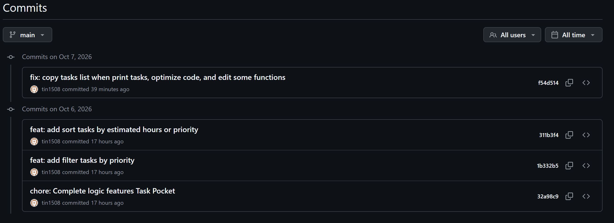

## 8. Problem Solving (Task Pocket)
### 1. Tình huống 1 — Mở rộng business state

**Câu hỏi:** Sau khi bài chạy ổn, yêu cầu thay đổi: hệ thống cần thêm một trạng thái mới (Thêm status "archived" cho Task). 

**Trả lời:**
*   **File/Type cần thay đổi:** File `src/task.types.ts`, cụ thể là type alias `Status`.
*   **Code type cần cập nhật:**
    ```typescript
    export type Status = "todo" | "doing" | "done" | "archived";
    ```
*   **Phân tích ảnh hưởng:** 
    *   Hàm Custom Type Guard (`isTask` trong `src/task.service.ts`) sẽ bị sai logic nếu không cập nhật thêm điều kiện kiểm tra chuỗi `"archived"`.
    *   Bất kỳ logic nào đang dùng `switch/case` hoặc `if/else` dựa trên `task.status` sẽ bị thiếu nhánh xử lý cho trạng thái mới.
*   **Cách kiểm tra bằng compiler:** Chạy lệnh `npx tsc --noEmit`. Trình biên dịch sẽ báo lỗi tại các chỗ chưa xử lý trạng thái `"archived"`.
*   **Quy trình Git:**
    ```bash
    git pull origin main
    # ...thực hiện sửa code local...
    npx tsc --noEmit
    git add .
    git commit -m "feat: add archived status for tasks"
    git push -u origin main
    ```
### 2. Tình huống 2 — Optional và Nullable bị xử lý sai
**Câu hỏi:** Một thành viên trong nhóm viết code truy cập trực tiếp vào field có thể thiếu/null và chương trình có nguy cơ lỗi hoặc in dữ liệu không đúng. Giải thích vì sao code trên không an toàn trong strict mode. Đề xuất cách sửa bằng narrowing hoặc fallback. Phân biệt rõ optional property và property có kiểu string | null bằng ví dụ trong domain đã chọn.

**Trả lời:**
*   **Vì sao code không an toàn trong strict mode**, TypeScript sẽ nhận diện `item.optionalField` có thể là `undefined` và `item.nullableField` có thể là `null`. Việc gọi trực tiếp `.toUpperCase()` lên chúng có thể gây ra lỗi runtime làm crash ứng dụng.
*   **Cách sửa (Narrowing / Fallback):**
    ```typescript
    // Fallback: Dùng Optional Chaining và Nullish Coalescing
    console.log(item.optionalField.toUpperCase() ?? "KHÔNG CÓ FIELD NÀY");

    // Narrowing: Dùng if để loại trừ null
    if (item.nullableField !== null) {
      console.log(item.nullableField.toUpperCase());
    }
    ```
*   **Phân biệt Optional và Nullable (lấy ví dụ trong Task Pocket):**
    *   **Optional (`note?: string`):** Field này có thể hoàn toàn không tồn tại trong object Task.
    *   **Nullable (`assignee: string | null`):** Field này bắt buộc phải được khai báo trong object Task. Nếu không có người phụ trách, lập trình viên phải chủ động gán giá trị `null`, thể hiện chủ đích rõ ràng.
## 2.3. Tình huống 3 — `any` làm mất type safety
**Câu hỏi:** Một bạn đề xuất đổi raw data thành `any` để compiler không báo lỗi. Giải thích vấn đề của `any` trong ví dụ. Đổi hướng xử lý sang `unknown`. Mô tả hoặc viết custom type guard phù hợp với Task. Giải thích tại sao sau khi type guard trả true thì code được phép truy cập field.

**Trả lời:**
*   **Vấn đề của `any`:** `any` vô hiệu hóa hoàn toàn trình kiểm tra kiểu của TypeScript. Nó cho phép truy cập vào các thuộc tính không tồn tại (như `notExistingField`) mà không báo lỗi lúc compile, dẫn đến lỗi chắc chắn xảy ra khi chạy (runtime).
*   **Hướng xử lý với `unknown` và Custom Type Guard:**
    ```typescript
    //custom type guard to check if an unknown value is a Task
    export function isTask(value: unknown): value is Task {
        if(typeof value !== "object" || value === null) return false;
        const task = value as Record<string, unknown>;
        const validStatus = task.status === "todo" || 
                            task.status === "doing" || 
                            task.status === "done";
        const validPriority = task.priority === "low" ||
                            task.priority === "medium" || 
                            task.priority === "high";
        return (typeof task.id === "string" && 
                typeof task.title === "string" && 
                typeof task.estimatedHours === "number" && 
                validStatus &&
                validPriority);
    };
    ```
*   **Lý do an toàn khi truy cập:** Mệnh đề `value is Task` ở đây đóng vai trò là Type Predicate. Khi hàm trả về `true`, compiler tự động thu hẹp (narrow) kiểu của `value` từ `unknown` sang `Task` trong phạm vi khối lệnh `if`, cho phép truy cập các thuộc tính một cách an toàn.

## 2.4. Tình huống 4 — GitHub có code mới trước khi bạn push
**Câu hỏi:** Bạn sửa code local nhưng đồng đội/giáo viên đã cập nhật repository trên GitHub trước đó. Nêu flow lệnh nên dùng bắt đầu từ việc lấy code mới nhất. Giải thích vai trò của git pull, git status, git add, git commit, git push. Nếu sau git pull có conflict, nêu nguyên tắc xử lý ở mức khái niệm.

**Trả lời:**
*   **Flow lệnh:**
    ```bash
    git pull origin main
    # ...xử lý conflict nếu có...
    npx tsc --noEmit
    git add .
    git commit -m "fix: resolve conflict and update features"
    git push origin main
    ```
*   **Vai trò các lệnh:**
    *   `git pull`: Tải code mới từ remote và gộp vào nhánh local hiện tại.
    *   `git status`: Kiểm tra trạng thái các file (đã sửa, chưa track, đang conflict).
    *   `git add`: Đưa các thay đổi (hoặc file đã giải quyết conflict) vào Staging Area.
    *   `git commit`: Lưu một bản ghi lịch sử cục bộ cho các thay đổi.
    *   `git push`: Đẩy các commit từ local lên kho lưu trữ từ xa.
*   **Nguyên tắc xử lý conflict:** Đọc kỹ các phần mã bị đánh dấu (`<<<<<<<`, `=======`, `>>>>>>>`). Đối chiếu logic giữa hai phiên bản để chọn hoặc kết hợp thành mã đúng. Xóa các điểm đánh dấu conflict, lưu file, chạy type-check (`tsc`) để đảm bảo không lỗi trước khi commit.

## 2.5. Tình huống 5 — Refactor từ 1 file sang module
**Câu hỏi:** Ban đầu toàn bộ type, data, functions và console output đều nằm trong index.ts. Khi bài dài hơn, giáo viên yêu cầu tổ chức lại. Đề xuất cấu trúc tối thiểu 4 file. Giải thích dữ liệu nào nên nằm ở types, data, service và index. Cho 1 ví dụ export/import giữa hai file. Giải thích vì sao `index.ts` vẫn nên giữ vai trò entry point thay vì chứa toàn bộ business logic.

**Trả lời:**
*   **Cấu trúc 4 file tối thiểu:**
    1. `task.types.ts`
    2. `task.data.ts`
    3. `task.service.ts`
    4. `index.ts`
*   **Phân bổ dữ liệu:**
    *   **types:** Chứa Type, Interface, Union, Function signatures. Không chứa logic hay object khai báo thật.
    *   **data:** Chứa mảng dữ liệu mẫu (mock data) và các biến raw test.
    *   **service:** Chứa các hàm xử lý logic (print, filter, tính toán, type guard).
    *   **index:** Entry point nhập các thành phần trên để chạy kịch bản ứng dụng.
*   **Ví dụ Export/Import:**
    *   Trong `src/task.types.ts`: `export interface Task { ... }`
    *   Trong `src/task.service.ts`: `import { Task } from "./task.types";`
*   **Vai trò của `index.ts`:** Việc tách module giúp mã nguồn dễ bảo trì và tái sử dụng. `index.ts` đóng vai trò điều phối (entry point) — nó ghép nối dữ liệu và logic lại với nhau để thực thi (gọi hàm và in ra màn hình). Nếu nhồi nhét business logic vào `index.ts`, file này sẽ trở thành một "god file" khó đọc, khó kiểm thử và phá vỡ nguyên tắc phân tách trách nhiệm (Separation of Concerns).
## 9. Interview Questions

**1. TypeScript khác JavaScript ở điểm nào liên quan đến compile-time safety? Cho một ví dụ lỗi mà TypeScript bắt trước runtime.**
* TypeScript kiểm tra lỗi ngay trong lúc viết code (compile-time), còn JavaScript chỉ phát hiện lỗi khi code đang chạy (runtime). 
*   **Ví dụ:** Gọi một hàm bị sai tên: `task.titel.toUpperCase()`. TypeScript sẽ báo lỗi đỏ ngay trong IDE vì property `titel` không tồn tại, giúp tránh lỗi màn hình trắng khi lên app.

**2. Type inference là gì? Khi nào nên để compiler suy luận, khi nào nên khai báo type rõ?**
* Type inference là khả năng compiler tự đoán kiểu dữ liệu dựa trên giá trị gán vào. Nên để tự suy luận với các biến đơn giản (vd: `let count = 0;`). Bắt buộc khai báo type rõ ràng với parameter của hàm, return type của hàm, hoặc khi khởi tạo object rỗng/phức tạp để đảm bảo tính chặt chẽ.

**3. Primitive types string, number, boolean thường được dùng trong mobile logic như thế nào?**

*   `string`: Lưu text (ID công việc, tiêu đề, tên người phụ trách).
*   `number`: Lưu các giá trị định lượng (số giờ dự kiến, index, giá tiền).
*   `boolean`: Lưu trạng thái nhị phân (cờ ẩn/hiện UI, isLoading, cờ báo lỗi).

**4. Array `Task[]` khác tuple `[string, number]` ở điểm nào? Cho tình huống phù hợp cho mỗi loại.**
*   **Array (`Task[]`):** Không giới hạn số lượng phần tử, tất cả cùng một kiểu. Dùng để render danh sách (vd: list công việc hiển thị trên màn hình).
*   **Tuple (`[string, number]`):** Cố định số lượng và kiểu của từng vị trí. Dùng khi cần return nhiều giá trị cục bộ (vd: hook `[state, setState]` trong React, hoặc cặp `[latitude, longitude]`).

**5. Type alias và interface đều mô tả object contract. Bạn dùng chúng thế nào trong bài Assignment?**
*   Dùng **interface** để định nghĩa cấu trúc của entity (`interface Task`), vì nó mang ý nghĩa hướng đối tượng và dễ mở rộng.
*   Dùng **type alias** để định nghĩa các Union/Literal types (`type Status = "todo" | "doing"`) hoặc Function signature, vì interface không làm được điều này.

**6. Union type và literal type giúp tránh lỗi business state như thế nào?**
* Bằng cách giới hạn chặt chẽ tập hợp giá trị hợp lệ. Nếu định nghĩa `type Status = "todo" | "done"`, compiler sẽ báo lỗi lập tức nếu ta gán nhầm `"pending"` hay viết sai chính tả `"doin"`, loại bỏ triệt để lỗi logic trạng thái rác.

**7. Giải thích khác nhau giữa `field?: string` và `field: string | null`.**
*   `field?: string`: Optional, có thể bỏ qua hoàn toàn khi tạo object (sẽ ra `undefined`).
*   `field: string | null`: Nullable, bắt buộc phải khai báo key này trong object. Nếu không có giá trị, phải truyền `null`, nếu không compiler sẽ báo lỗi.

**8. Tại sao `any` nguy hiểm hơn `unknown` khi nhận dữ liệu bên ngoài?**
* `any` tắt hoàn toàn Type Checker, cho phép gọi hàm vô tội vạ lên data đó gây nguy cơ crash app. `unknown` an toàn vì nó ép lập trình viên phải viết type guard (narrowing) để chứng minh kiểu dữ liệu trước khi được phép thao tác.

**9. Narrowing là gì? Tại sao phải kiểm tra `item !== null` trước khi truy cập field khi return type là `T | null`?**
* Narrowing là kỹ thuật thu hẹp một type rộng (như `Task | null`) xuống thành một type cụ thể (`Task`). Phải kiểm tra `!== null` (trong strict mode) để compiler đảm bảo lập trình viên không vô tình truy cập field của `null`, nguyên nhân hàng đầu gây sập ứng dụng (NullPointerException).

**10. Function type/callback là gì? Hãy giải thích callback openTask trong bài của bạn.**
* Function type mô tả hình dáng của một hàm (nhận tham số gì, trả về gì). Callback `openTask: (task: Task) => void` cho phép ta định nghĩa trước hành động sẽ xảy ra khi user bấm vào một task trên UI, tách biệt logic nhấn nút khỏi logic xử lý nghiệp vụ bên dưới.

**11. Đoạn function filter nên khai báo parameter và return type như thế nào để compiler hỗ trợ tốt?**
* Khai báo: `function filterTasksByStatus(tasksList: Task[], taskFilter: StatusFilter): Task[]`. Cách này giúp IDE báo lỗi nếu ta truyền sai status, và đảm bảo kết quả trả về luôn là mảng Task để các hàm tiếp theo (như render) có thể dùng `.map()` an toàn.

**12. Tại sao cần tách `*.types.ts`, `*.data.ts`, `*.service.ts` và `index.ts`?**
* Để tuân thủ nguyên tắc Separation of Concerns (SoC). Tách biệt interface (hợp đồng), data giả (test), và logic xử lý (service) giúp source code dễ đọc, dễ bảo trì, dễ viết unit test và tránh xung đột khi làm việc nhóm so với việc nhồi nhét vào một God File.

**13. Khác nhau giữa `git add`, `git commit`, `git push` và `git pull` là gì?** 
*   `add`: Đưa file vừa sửa vào khu vực chờ (Staging).
*   `commit`: Chụp ảnh và lưu lại một mốc lịch sử cục bộ trên máy.
*   `push`: Bắn lịch sử từ máy local lên server (GitHub).
*   `pull`: Kéo code mới nhất từ server về máy và gộp vào code hiện tại.

**14. Tại sao `node_modules/` và `dist/` nên nằm trong `.gitignore` của bài này?**
* `node_modules/` chứa hàng ngàn file thư viện tải từ npm, rất nặng và tự sinh lại được bằng lệnh `npm install`. `dist/` chứa code JS được tự động dịch ra từ TS. Commit những thư mục tự sinh này làm rác repository và gây conflict vô ích.

**15. GitHub Actions trong Lab01 đang kiểm tra điều gì? Vì sao `npx tsc --noEmit` phù hợp với CI ở bài này?**
* Nó kiểm tra xem code có vi phạm lỗi type nào không trước khi merge. `npx tsc --noEmit` chỉ phân tích type safety mà không sinh ra file JS thật, giúp pipeline chạy rất nhanh, nhẹ và phản hồi lỗi tức thì trên PR.

---


## 10. Self-check
**Đã hoàn thành đầy đủ tất cả các chức năng cũng như các yêu cầu.**

**Phần làm thêm:** sắp xếp task theo tổng số giờ hoàn thành của mỗi task hay mức độ ưu tiên hoàn thành của mỗi (sortTasks), lọc task theo mức độ mong muốn (filterTasksByPriority). 