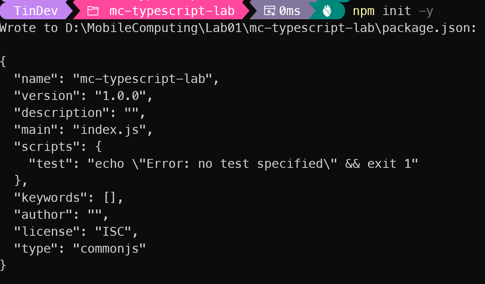
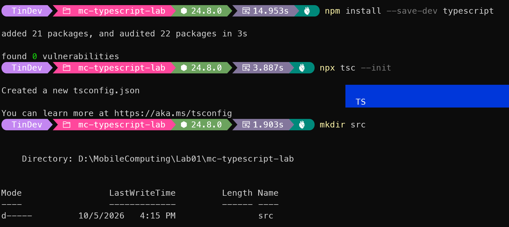
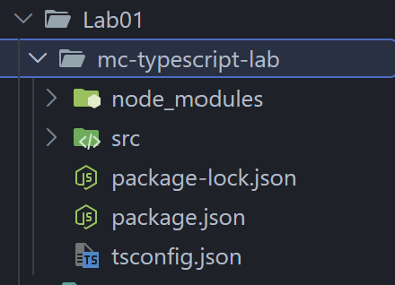

 # Báo Cáo Bài Tập Thực Hành MCLab01

## 1. Thông tin sinh viên
* **MSSV:** 23110156
* **Họ tên:** Nguyễn Minh Hoàng
* **Lựa chọn bài toán:** A - Task Pocket - Quản lý công việc cá nhân

## 2. Problem & Requirements
* **Mô tả ngắn bài toán:**
Xây dựng phần logic cho một ứng dụng điện thoại quản lý công việc cá nhân. Chưa có giao diện; người dùng được mô phỏng bằng các thao tác gọi hàm trong index.ts và xem kết quả trên Terminal. Với ứng dụng, người dùng có thể quản lý danh sách các công việc cá nhân. Mỗi công việc sẽ có mã số, tên, số giờ dự kiến sẽ làm công việc đó, trạng thái, mức độ ưu tiên, và có thể có người phụ trách. Chương trình sẽ hiển thị dữ liệu output qua console, lọc theo trạng thái, tính tổng số giờ dự kiến, tìm công việc theo ID và xử lý các tình huống dữ liệu không đầy đủ.

* **Các chức năng đã làm:**

    | Chức năng logic | Output quan sát trong Terminal | Khái niệm TypeScript |
    |-----------------|--------------------------------|----------------------|
    | Danh sách Task | In từng công việc | Array of objects + type alias |
    | Task status | todo/doing/done | Literal union |
    | Assignee có thể thiếu | "Chưa phân công" khi chưa có | Optional/Nullable + ?? |
    | Filter | Danh sách theo trạng thái | Typed function |
    | Tổng số giờ dự kiến | Tổng số giờ theo filter | number return type |
    | Tìm task theo ID | Task hoặc null | Union + narrowing |
    | Action/callback | Mô phỏng mở Task | Function type |
    | Raw data validation | Reject dữ liệu sai | unknown + type guard |

## 3. Type Model

## 4. Logic chính

## 5. Kết quả chạy

## 6. Code Organization

## 7. Git/Github/CI

## 8. Problem Solving

## 9. Interview Questions

## 10. Self-check